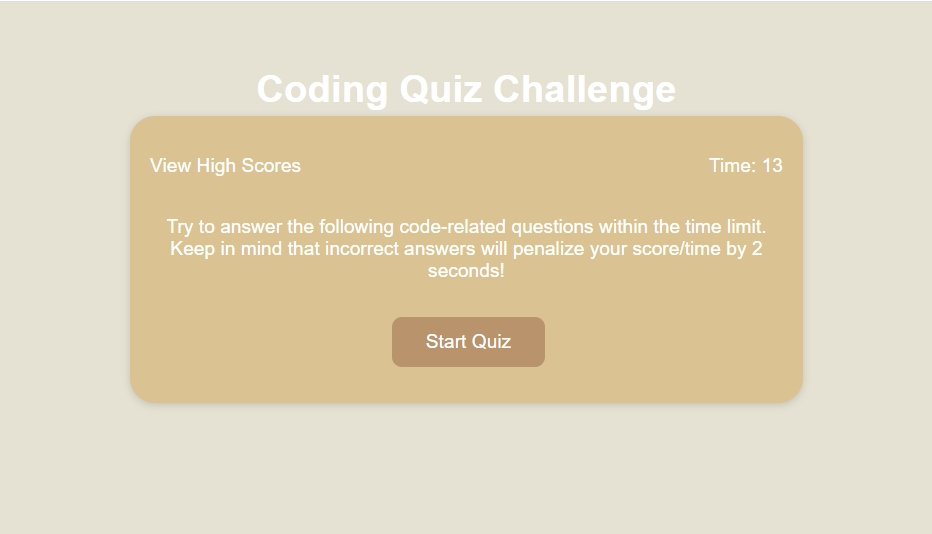
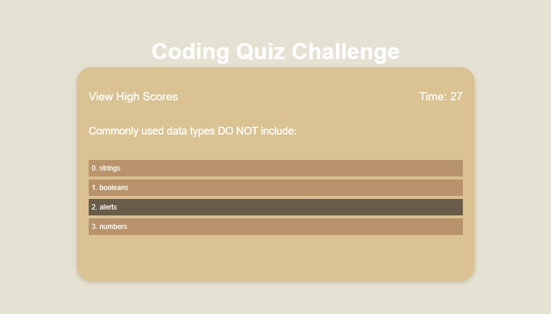
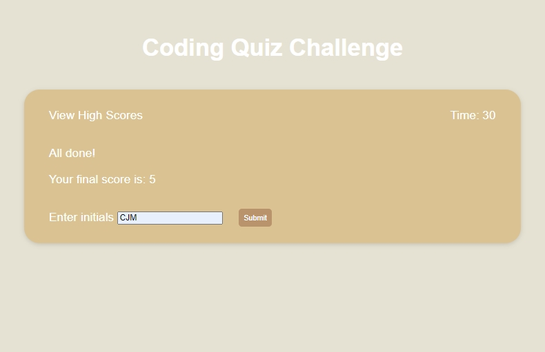
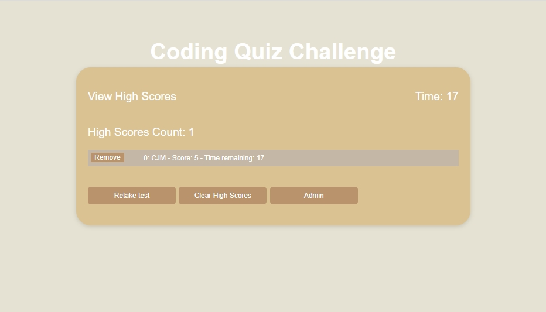

# Code Quiz

* [Description](#Description)
* [Technologies Utilized](#Technologies-Utilized)
* [Code Quiz Link](#Code-Quiz-Link)
* [Contact](#Contact)

## Description
This is a timed multiple-choice quiz on JavaScript fundamentals that stores the highest scores.

Compare score with your peers.

This app runs in the browser and featuring dynamically updated HTML and CSS powered by JavaScript. It includes the use of localStorage to save highest scores

It features a clean and polished user responsive interface, adapting to 992, 768, and 400 wide screens and wider screen sizes.

The test:
* Click the start button
* A timer starts
* Questions are presented
* Each correct answer score a point
* Each incorrect answer lose 2 seconds
* Quiz is over when either all questions are answered or the timer reaches 0
* Enter your initials to save your score, your highest score is kept
* Clear the high score list

|  |  |
| ------------- | ------------- |
|  |  |
|  |  |

## Technologies Utilized
Primary technologies:
* Javascript
* Bootstrap 4.5.2
* HTML-5
* CSS-3

## Code Quiz Link

* Please find Code Quiz page here: <a href="https://chrisjmckeown.github.io/Code_Quiz/" target="_blank">Code Quiz</a>

## Contact

* Please contact me at: chris.j.mckeown@hotmail.com